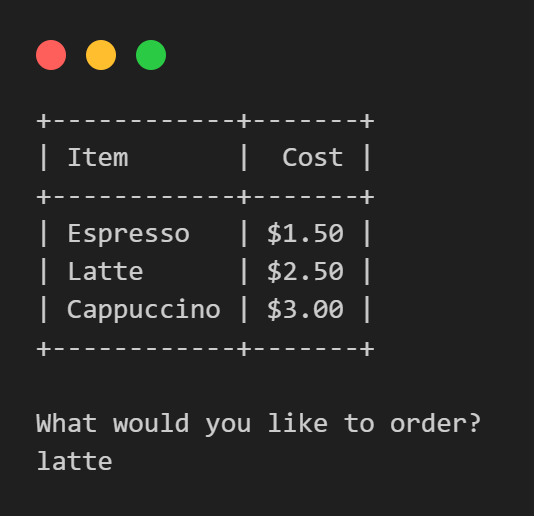
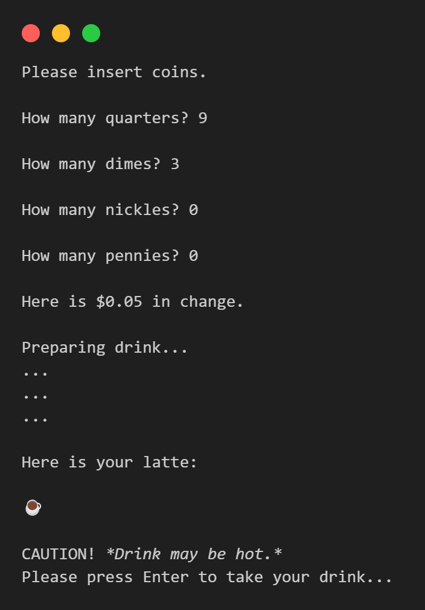
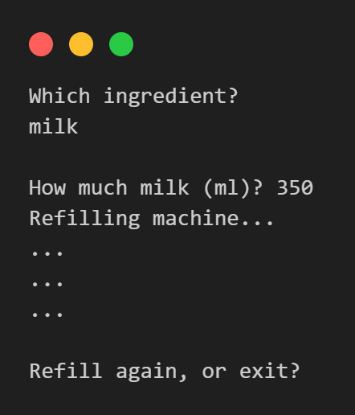
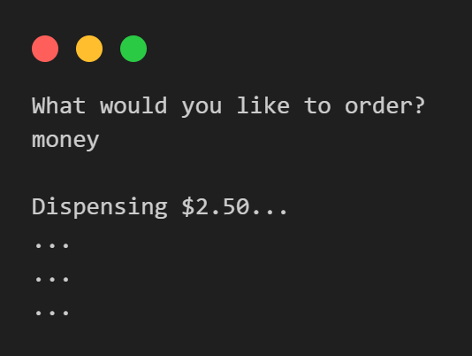
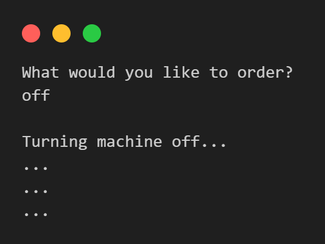

# Coffee vending machine

A script to simulate interaction with a coffee vending machine via the command line interface as a customer or as an owner (via secret commands).

## Order beverage

## Insert coins

## Check supplies

## Restock ingredients

## Withdraw profit

## Turn off

